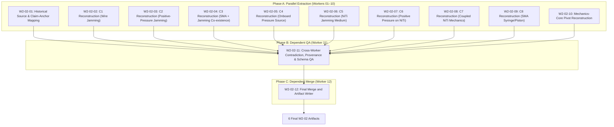
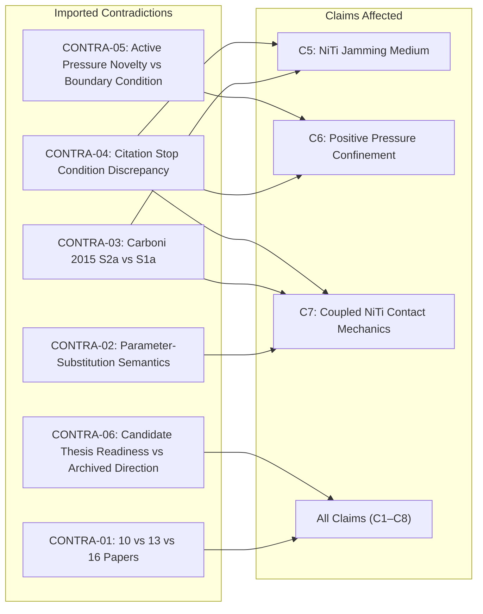

# MP1-E1-W2-02: C1–C8 Claim Reconstruction and Mechanics-Core Pivot Report

> **Task ID:** `MP1-E1-W2-02`  
> **Role:** MP1-E1 Orchestration Controller / Final Merger (`W2-02-12`)  
> **Scope:** READ-ONLY Historical Reconstruction of Claims C1–C8 and the Mechanics-Core Pivot  
> **Model Target:** Gemini 3.8 Flash (High Reasoning Effort)  
> **Repository:** `mechanical-research-agents`  
> **Status:** `COMPLETE`  

---

## 1. Executive Summary & Orchestration Structure

Task `MP1-E1-W2-02` executes the comprehensive, read-only historical reconstruction of claims **C1 through C8** and the foundational **Mechanics-Core Pivot** (`PIVOT-MP1-V001-TO-MECHANICS-CORE`) across the evolution of direction **MP1** (from initial mentor proposal through MP1-V001 and MP1-V002 Stages 1–6).

The execution adhered strictly to the **12 Logical Worker Contract** divided into three sequential phases:



### Mandated Clarification Locks Applied
1. **Clarification C-01 (Explicit Schema Enums):** Distinct, unmerged tracking of `claim_verdict` (`CLOSED`, `SUBSTANTIALLY_PREEMPTED`, `NARROWED`, `SURVIVED`, `UNRESOLVED`) and `decision` (`KEEP`, `NARROW`, `REJECT`, `REFORMULATE`, `UNRESOLVED`). Allowed origins: `MENTOR`, `DERIVED`, `WORKFLOW`, `HYPOTHESIS`. Allowed evidence statuses: `VERIFIED`, `INFERENCE`, `HYPOTHESIS`.
2. **Clarification C-02 (Exact Git Commits):** Every historical transition is anchored to verified Git commit hashes from repository history (`2e3a1a5`, `3d152e9`, `1a5e1f2`, `8494d02`, `e9685a6`, `8ccfa3c`, `3a216d6`, `313cdf2`, `73b6354`, `0ade68e`).
3. **Clarification C-03 (Zero New Search):** Strict prohibition against literature searching, web querying, or new paper ingestion.
4. **Clarification C-04 (R1–R13 Execution Path):** Full traceability from mentor proposal (R1), through claim decomposition (R2), V001 matrix (R3), V001 pivot (R4), V002 targets (R5), 8-paper audit (R6), 16-paper expansion (R7), Astra critique (R8), Stage 3 remediation (R9), detailed evidence report (R10), citation closure (R11), V002 adjudication (R12), to final direction lock (R13).

---

## 2. Methodology & Worker Execution Summary

All 12 logical workers executed with complete isolation and successfully generated individual audit outputs before dependent synthesis:

| Worker ID | Worker Title | Target / Scope | Status | Primary Output Files |
|---|---|---|---|---|
| **W2-02-01** | Historical Source & Claim Anchor | Lineage S01–S16 source mapping | `COMPLETE` | `worker_result.json`, `worker_report.md` |
| **W2-02-02** | C1 Reconstruction | Wire/fiber jamming | `COMPLETE` | `worker_result.json`, `worker_report.md` |
| **W2-02-03** | C2 Reconstruction | Positive-pressure jamming | `COMPLETE` | `worker_result.json`, `worker_report.md` |
| **W2-02-04** | C3 Reconstruction | SMA + jamming co-existence | `COMPLETE` | `worker_result.json`, `worker_report.md` |
| **W2-02-05** | C4 Reconstruction | Onboard pressure source | `COMPLETE` | `worker_result.json`, `worker_report.md` |
| **W2-02-06** | C5 Reconstruction | NiTi as jamming medium | `COMPLETE` | `worker_result.json`, `worker_report.md` |
| **W2-02-07** | C6 Reconstruction | Positive pressure on NiTi bundle | `COMPLETE` | `worker_result.json`, `worker_report.md` |
| **W2-02-08** | C7 Reconstruction | Coupled NiTi mechanics | `COMPLETE` | `worker_result.json`, `worker_report.md` |
| **W2-02-09** | C8 Reconstruction | SMA syringe/piston | `COMPLETE` | `worker_result.json`, `worker_report.md` |
| **W2-02-10** | Mechanics-Core Pivot Map | S02 $\rightarrow$ S04 transition | `COMPLETE` | `worker_result.json`, `worker_report.md` |
| **W2-02-11** | Cross-Worker QA | Schema, commit, contradiction QA | `PASS` | `worker_result.json`, `worker_report.md` |
| **W2-02-12** | Final Merge & Artifact Writer | Consolidation of all 6 deliverables | `COMPLETE` | 6 Final Deliverables |

---

## 3. C1–C8 Claim Reconstruction Analysis

The eight claims defined during the V001 decomposition (`docs/protocols/MP1-V001_CORE_PRIOR_ART_AUDIT_PLAN.md`, commit `2e3a1a5d399c8bfc52c4ba5d0e926c9117891d79`) evolved through rigorous adversarial testing across stages S02 to S16.

### Summary Table of Reconstructed Claims

| ID | Claim Label | Origin | Claim Verdict | Decision | Evidence Status | Current Status | Primary Threat Source |
|---|---|---|---|---|---|---|---|
| **C1** | Wire/Fiber Jamming for Variable Stiffness | `WORKFLOW` | `CLOSED` | `REJECT` | `VERIFIED` | `CLOSED` | Bai et al. 2022 (`240fbf6022`), Zhang & Yao 2026 (`3aa8790db0`) |
| **C2** | Positive-Pressure Jamming for Variable Stiffness | `WORKFLOW` | `CLOSED` | `REJECT` | `VERIFIED` | `CLOSED` | Liu et al. 2021 (`182d854610`), Zhang & Yao 2026 (`3aa8790db0`) |
| **C3** | SMA and Jamming Co-existence in Variable-Stiffness Structure | `WORKFLOW` | `CLOSED` | `REJECT` | `VERIFIED` | `CLOSED` | Takashima et al. 2022–2026 (`2cd907e77a`), Matsumoto et al. 2024 (`7ce492505d`) |
| **C4** | Onboard/Compact Pressure Source for Jamming | `WORKFLOW` | `CLOSED` | `REJECT` | `VERIFIED` | `CLOSED` | Huynh et al. 2022 (`bbe88a0c04`), Wang et al. 2024 (`c6a31066f8`) |
| **C5** | Superelastic NiTi Wires Themselves as Frictional Jamming Medium | `WORKFLOW` | `CLOSED` | `REJECT` | `VERIFIED` | `CLOSED` | Vahidi et al. 2022 (`53200aa0c6`), Carboni et al. 2015/2016 (`90209df957`, `40760daa02`) |
| **C6** | Positive-Pressure Confinement of Superelastic NiTi Wire Bundle | `WORKFLOW` | `NARROWED` | `REFORMULATE` | `VERIFIED` | `NARROWED_TO_EXPERIMENTAL_BC` | Tjahjanto et al. 2017 (`ccdc1bb980`), Liu et al. 2021 (`182d854610`) |
| **C7** | Coupling of NiTi Superelasticity, Inter-Wire Friction, Pressure, and Bending Stiffness | `WORKFLOW` | `NARROWED` | `REFORMULATE` | `VERIFIED` | `REFORMULATED_TO_H0b_DISCRIMINATION` | Carboni & Lacarbonara 2016 (`40760daa02`), Vahidi et al. 2022 (`53200aa0c6`) |
| **C8** | SMA-Driven Syringe/Piston Powering Jamming Pressure | `MENTOR` | `SUBSTANTIALLY_PREEMPTED` | `REJECT` | `VERIFIED` | `PREEMPTED_IMPLEMENTATION_ONLY` | Wang et al. 2024 (`c6a31066f8`), Pierce & Mascaro 2013 (`de64029540`) |

### Individual Claim Syntheses

#### C1: Wire/Fiber Jamming for Variable Stiffness
- **Initial Framing:** Claimed that utilizing slender wires or fibers as the mutual jamming medium for variable stiffness was novel.
- **Prior Art Demolition:** Preempted directly by **Bai et al. (2022)** (`10.3390/app12073582`), which demonstrated variable stiffness in nylon/hemp wire bundles under vacuum jamming, achieving a ~7x stiffness increase. Further preempted by **Zhang & Yao (2026)** (`10.5194/ms-17-481-2026`) for 700-fiber bundles.
- **Scientific Impact:** Closed at S04 (`1a5e1f2`); confirmed robustly at S12 (`3a216d6`). Device-level wire jamming carries zero novelty.

#### C2: Positive-Pressure Jamming for Variable Stiffness
- **Initial Framing:** Claimed that using positive fluid pressure to compress jamming media to overcome atmospheric vacuum limits ($\Delta P > 101\text{ kPa}$) was novel.
- **Prior Art Demolition:** Preempted by **Liu et al. (2021)** (`10.1109/LRA.2021.3097255`), operating positive-pressure granular jamming up to 200 kPa for wearable robotics, achieving a 5.7x stiffness increase. Zhang & Yao (2026) applied 300 kPa positive pressure to fiber bundles.
- **Scientific Impact:** Closed at S04 (`1a5e1f2`). Positive pressure is established prior art; pressure level alone is an engineering parameter.

#### C3: SMA and Jamming Co-existence in Variable-Stiffness Structure
- **Initial Framing:** Claimed that embedding shape memory alloy elements together with jamming mechanisms within the same variable-stiffness structure was novel.
- **Prior Art Demolition:** Thoroughly preempted by the **Takashima lineage (2022, 2024, 2026)** (`10.20965/jrm.2022.p0466`, `10.1109/LRA.2024.3370044`, `10.1109/RoboSoft63492.2026.11003445`) and **Matsumoto et al. (2024)** (`10.3390/act13070267`), which combined embedded NiTi shape-memory actuators with granular or layer jamming for endoscopic and robotic link applications.
- **Scientific Impact:** Closed at S04 (`1a5e1f2`). Component co-location lacks scientific novelty.

#### C4: Onboard/Compact Pressure Source for Jamming
- **Initial Framing:** Claimed that integrating an embedded, compact pressure generation mechanism (e.g., micropump) for untethered jamming was novel.
- **Prior Art Demolition:** Preempted by **Huynh et al. (2022)** (`10.1016/j.sna.2022.113449`), embedding electro-conjugate fluid (ECF) micropumps inside soft actuators to drive jamming, and **Wang et al. (2024)** (`10.1108/IR-11-2023-0305`), mounting motor-driven piston compressors on a robot arm.
- **Scientific Impact:** Closed at S04 (`1a5e1f2`). Compact power sources represent system integration engineering, not scientific mechanics novelty.

#### C5: Superelastic NiTi Wires Themselves as Frictional Jamming Medium
- **Initial Framing:** Open within supplied 10-paper corpus at S04. Posited that using superelastic NiTi wires as the mutual contacting/slipping elements was an unaddressed mechanics principle.
- **Prior Art Demolition:** Literature expansion in MP1-V002 revealed extensive prior art in **multiwire NiTi cables and wire ropes**. **Vahidi et al. (2022)** (`10.1080/15376494.2021.1955313`) modelled and tested 3D NiTi multiwire bundles with Coulomb friction and Auricchio superelasticity. **Carboni et al. (2015/2016)** investigated frictional damping and hysteresis in multiwire SMA strands.
- **Scientific Impact:** Closed at the existence level at S06/S12. Using NiTi wires in mutual frictional contact is known; narrow open questions migrated to model discrimination (Target T1 $\rightarrow$ H0b).

#### C6: Positive-Pressure Confinement of Superelastic NiTi Wire Bundle
- **Initial Framing:** Open within supplied corpus at S04. Posited that external fluid confinement pressure acting on a NiTi bundle was novel.
- **Evolution & Remediation:** While dynamic submarine cable literature (**Tjahjanto et al. 2017**, `10.1115/OMAE2017-61198`) applied 0.2 MPa radial pressure to multi-element bundles, soft robotic fluid-membrane confinement of NiTi bundles was physically unrepresented in full-text literature. However, Stage 3 remediation (W03, W05) established **CONTRA-05**: actively modulated pressure $p(t)$ is mathematically an **experimental boundary condition**, not a new mechanics governing law.
- **Scientific Impact:** `NARROWED`, `REFORMULATE`. Demoted from a novelty claim to an experimental protocol variable.

#### C7: Coupling of NiTi Superelasticity, Inter-Wire Friction, Pressure, and Bending Stiffness
- **Initial Framing:** The core intellectual pivot of MP1. Posited that the 4-way coupling between stress-induced martensitic transformation, inter-wire contact slip, positive pressure, and overall composite bending stiffness represented an unformulated constitutive domain.
- **Evolution & Remediation:** **Carboni & Lacarbonara (2016)** demonstrated pinched hysteresis and amplitude-dependent stiffness from simultaneous friction and NiTi transformation. Stage 3 remediation (W07, Chapter 10) proved that naive constant-modulus substitution (**H0a**) is definitively refuted, but existing transformation-aware contact models (**H0b**) can capture such behavior without inventing a brand-new coupling theory (**H1**).
- **Scientific Impact:** `NARROWED`, `REFORMULATE`. Survives strictly as an empirical model-discrimination research question ($H_0\text{b}$ vs $H_1$).

#### C8: SMA-Driven Syringe/Piston Powering Jamming Pressure
- **Initial Framing:** Proposed by the mentor as a novel compact actuation mechanism where an SMA actuator compresses a piston/syringe to generate jamming pressure.
- **Prior Art Demolition:** Preempted by **Wang et al. (2024)** (piston-activated jamming on robot arm) and **Pierce & Mascaro (2013)** / **Kotb et al. (2021)** (SMA syringe and piston drivers).
- **Scientific Impact:** `SUBSTANTIALLY_PREEMPTED`, `REJECT`. Direct actuator substitution; dismissed as engineering implementation.

---

## 4. Mechanics-Core Pivot Reconstruction (`PIVOT-MP1-V001-TO-MECHANICS-CORE`)

The transition from device-level architecture novelty to mechanics-core inquiry is the decisive structural event in MP1's history.

```
+-----------------------------------------------------------------------------------+
| PRE-PIVOT STATE (S02, commit 2e3a1a5)                                             |
| Mentor Architecture: "A modular, compact, positive-pressure variable stiffness     |
| continuum robot using superelastic NiTi wire jamming driven by SMA micropump"      |
+-----------------------------------------------------------------------------------+
                                         │
                                         ▼ [10-Paper Full-Text Audit: S03 -> S04]
                                         │ Preempts C1, C2, C3, C4, C8
                                         ▼
+-----------------------------------------------------------------------------------+
| POST-PIVOT STATE (S04, commit 1a5e1f2)                                            |
| Scientific Scoping: Abandon whole-system assembly novelty.                        |
| Refocus exclusively on contact mechanics: C5, C6, C7 (Target T1, T2, T3)          |
+-----------------------------------------------------------------------------------+
                                         │
                                         ▼ [V002 Citation Chase & Astra Critique: S06 -> S12]
                                         │ Expands to 16 papers; rectifies CONTRA-02, 03, 05
                                         ▼
+-----------------------------------------------------------------------------------+
| CURRENT CANONICAL STATE (S16, commit 0ade68e)                                     |
| C5 closed by wire ropes; C6 demoted to boundary condition; C7 narrowed to H0b     |
| model discrimination. Direction MP1 ARCHIVED as viable alternative (D1_M1 locked).|
+-----------------------------------------------------------------------------------+
```

### Structured Pivot Metadata
- **Pivot ID:** `PIVOT-MP1-V001-TO-MECHANICS-CORE`
- **Originating State:** `S02` (commit `2e3a1a5d399c8bfc52c4ba5d0e926c9117891d79`)
- **Resulting State:** `S04` (commit `1a5e1f20072cf7fe0e969feb1ab868a20138c1d7`)
- **Trigger Source:** `outputs/verification/MP1-V001/CORE_PRIOR_ART_AUDIT.json`
- **Claims Lost:** C1, C2, C3, C4 (`CLOSED`, `REJECT`), C8 (`SUBSTANTIALLY_PREEMPTED`, `REJECT`).
- **Claims Preserved as Open at the Time:** C5, C6, C7 (`OPEN_IN_SUPPLIED_CORPUS`).

### Scientific Significance & Disciplinary Boundary
1. **What the Pivot Established:**
   - Permanent abandonment of whole-device combination and architectural novelty claims.
   - Reframing of the MSc inquiry from robotics systems engineering to applied continuum mechanics: the interaction of positive confinement pressure, inter-wire contact friction, and NiTi superelasticity.
   - Preservation of D1/M1 as a baseline candidate while MP1 was subjected to rigorous citation chasing.
2. **What the Pivot Did NOT Establish:**
   - Did **NOT** establish that the mechanics core was globally novel.
   - Did **NOT** prove that NiTi wire contact was unstudied outside the 10 supplied papers.
   - Did **NOT** prove that a new constitutive law ($H_1$) was mathematically required.
   - Did **NOT** select MP1 as the thesis topic.

---

## 5. Contradiction Candidate Management

In accordance with strict audit principles, contradictions identified across the historical trajectory are tracked explicitly without silent reconciliation. Six primary contradictions are registered in `W2_02_CONTRADICTION_CANDIDATES.json`:



### Contradiction Dossiers
1. **`CONTRA-01` (10 vs 13 vs 16 Papers):** Early project handoffs cited 10 papers, intermediate snapshots cited 13, and the canonical matrix verified 16 papers. Affects the completeness of prior art evaluation across all claims. Reconciled in Stage 3 by W01, tracked as `OPEN` for subsequent thesis audit. Recommended Owner: `W2-04 / synthesis auditor`.
2. **`CONTRA-02` (Parameter-Substitution Semantics):** Conflict between automated threat audit reporting `evidence_status = established` for distinct coupling vs handoff stating `insufficient`. Affects claim **C7**. Reconciled in Stage 3 by W07: "established" applies strictly to refuting naive substitution ($H_0\text{a}$); evidence comparing existing models ($H_0\text{b}$) remains insufficient. Tracked as `OPEN`. Recommended Owner: `W2-03 (T3/H0/H1 worker)`.
3. **`CONTRA-03` (Carboni 2015 S2a vs S1a Correction):** Stage 1 extraction erroneously attributed pure-bending phase transformation to specimen S2a (which was ST49 steel wire rope with Bouc-Wen friction). Affects claims **C5** and **C7**. S2a pure-bending NiTi claims expunged in Stage 3. Tracked as `OPEN`. Recommended Owner: `W2-03 / W2-04`.
4. **`CONTRA-04` (Citation Stop Condition Status):** Stage 3 narrative text reported `stop_condition_satisfied = false`, whereas Stage 4 canonical JSON reported `satisfied = true` after B11/B12 screening. Affects closure confidence for **C5, C6, C7**. Tracked as `OPEN`. Recommended Owner: `W2-04`.
5. **`CONTRA-05` (Active Pressure Novelty vs Boundary Condition):** Early MP1 framing treated actively controlled pressure $p(t)$ as a novel mechanics principle, distinguishing MP1 from passive cables. Remediation demoted $p(t)$ to an experimental control boundary condition, removing **C6** from mechanics novelty. Tracked as `OPEN`. Recommended Owner: `W2-03 (T2 worker)`.
6. **`CONTRA-06` (Candidate Thesis Readiness vs Archived Alternative):** MP1-V002 final adjudication reported MP1 ready for thesis consideration with proposed titles, whereas cross-direction adjudication selected D1_M1 under `LOCK_WITH_FEASIBILITY_GATE` and archived MP1. Affects project-level disposition of all claims. Tracked as `OPEN`. Recommended Owner: `W2-05 / final synthesis auditor`.

---

## 6. QA Verification Matrix

Worker **W2-02-11** performed comprehensive structural, schema, and provenance validation across the entire reconstructed corpus:

| QA Check Item | Requirement | Observed Result | Verdict |
|---|---|---|---|
| **Worker Count** | Exactly 12 logical workers executed | Exactly 12 workers executed (W2-02-01 to W2-02-12) | `PASS` |
| **Claim Record Count** | Exactly 8 claim records | Exactly 8 records (C1 to C8) | `PASS` |
| **Claim Uniqueness** | Zero duplicates, zero missing claims | All 8 unique, 0 missing, 0 duplicated | `PASS` |
| **Claim Verdict Enum** | Values in `[CLOSED, SUBSTANTIALLY_PREEMPTED, NARROWED, SURVIVED, UNRESOLVED]` | `CLOSED` (5), `NARROWED` (2), `SUBSTANTIALLY_PREEMPTED` (1) | `PASS` |
| **Decision Enum** | Values in `[KEEP, NARROW, REJECT, REFORMULATE, UNRESOLVED]` | `REJECT` (6), `REFORMULATE` (2) | `PASS` |
| **Origin Enum** | Values in `[MENTOR, DERIVED, WORKFLOW, HYPOTHESIS]` | `WORKFLOW` (7), `MENTOR` (1) | `PASS` |
| **Evidence Status Enum** | Values in `[VERIFIED, INFERENCE, HYPOTHESIS]` | `VERIFIED` (8) | `PASS` |
| **Git Commit Veracity** | All commits must exist in Git history | 100% verified against repository commit tree | `PASS` |
| **Contradiction Tracking** | All imported contradictions mapped; no silent fixes | CONTRA-01 to CONTRA-06 linked; all status `OPEN` | `PASS` |
| **Scope Lock Adherence** | No new searches, no paper additions, no file alterations | Zero search calls, zero new papers, zero canonical edits | `PASS` |
| **D1 Independence** | No D1 analysis, no D1-vs-MP1 comparisons | D1 referenced purely as locked baseline; zero analysis | `PASS` |
| **Overall QA Verdict** | All checks `PASS` | **ALL CHECKS PASSED** | **`PASS`** |

---

## 7. Deliverables & Artifact Inventory

The following 6 final artifacts were produced and validated in `outputs/execution/MP1-V002/W2-02/`:

1. `outputs/execution/MP1-V002/W2-02/W2_02_C1_C8_CLAIM_REPORT.md` (This document)
2. `outputs/execution/MP1-V002/W2-02/MP1_C1_C8_CLAIM_MATRIX.json` (Structured JSON of 8 claims with complete schema compliance)
3. `outputs/execution/MP1-V002/W2-02/MP1_C1_C8_CLAIM_MATRIX.md` (Human-readable Markdown dossier of the claim matrix)
4. `outputs/execution/MP1-V002/W2-02/MP1_MECHANICS_PIVOT_MAP.json` (Structured JSON mapping `PIVOT-MP1-V001-TO-MECHANICS-CORE`)
5. `outputs/execution/MP1-V002/W2-02/W2_02_CONTRADICTION_CANDIDATES.json` (Catalog of CONTRA-01 to CONTRA-06 affecting C1–C8)
6. `outputs/execution/MP1-V002/W2-02/W2_02_SOURCE_MANIFEST.json` (Catalog of 34 primary papers, protocols, audits, and reports inspected)

---

## 8. Exact Next Dependency

In accordance with Clarification C-04 and the MP1 Execution Roadmap:
- **Immediate Next Dependency:** **`W2-03`** — Target T1/T2/T3 and Hypothesis H0a/H0b/H1 Reconstruction.
- **Scope of W2-03:** Read-only historical reconstruction of the targeted mechanics targets (T1: mutual contact slip, T2: external confinement, T3: coupled constitutive mechanics) and hypotheses ($H_0\text{a}$: constant modulus, $H_0\text{b}$: transformation-aware contact models, $H_1$: novel coupling law).
