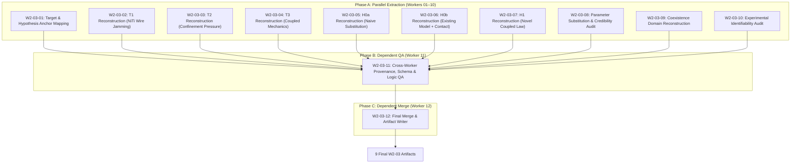
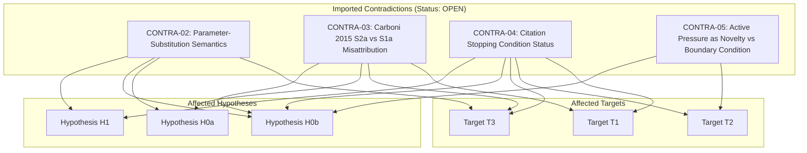

# MP1-E1-W2-03: Targets T1/T2/T3, Hypotheses H0a/H0b/H1, and Mechanics Rigor Synthesis Report

> **Task ID:** `MP1-E1-W2-03`  
> **Role:** MP1-E1 Orchestration Controller / Final Merger (`W2-03-12`)  
> **Scope:** READ-ONLY Historical Reconstruction of Targets T1/T2/T3, Hypotheses H0a/H0b/H1, and Mechanics Credibility Audits  
> **Model Target:** Gemini 3.8 Flash (High Reasoning Effort)  
> **Repository:** `mechanical-research-agents`  
> **Status:** `COMPLETE`  

---

## 1. Executive Summary & Orchestration Structure

Task `MP1-E1-W2-03` executes the read-only historical and scientific-logic reconstruction of:
1. The **three targeted mechanics targets** (`T1`, `T2`, `T3`);
2. The **tripartite hypothesis architecture** (`H0a`, `H0b`, `H1`);
3. The **parameter-substitution and 5-level model credibility hierarchy** (auditing Reedlunn 2013 and Fang 2019);
4. The **transformation/slip coexistence domain**;
5. The **experimental identifiability and mechanism confounding matrix**.

The execution adhered strictly to the **12 Logical Worker Contract** across three sequential phases:



### Mandated Clarification Locks Applied
- **Clarification C-01 (Separate Targets):** Targets T1, T2, and T3 remain distinct and unmerged.
- **Clarification C-02 (Logical Separation of Hypotheses):** H0a, H0b, and H1 are strictly decoupled. The logical fallacy:
  $$\text{H0a is rejected} \centernot\implies \text{H1 is true}$$
  is strictly enforced. H0b is preserved as a live competitor null hypothesis.
- **Clarification C-03 (Exact Git Commits):** Every historical transition is anchored to exact Git commit hashes (`8494d02`, `e9685a6`, `8ccfa3c`, `3a216d6`, `313cdf2`, `73b6354`, `0ade68e`).
- **Clarification C-04 (Zero New Search):** Strict prohibition against literature searching, web querying, or new paper additions.
- **Clarification C-05 (R1–R13 Traceability):** Execution follows downstream dependencies R1–R13 from Master Plan V2.

---

## 2. Reconstruction of Targets T1, T2, and T3

Targets T1, T2, and T3 were defined in `docs/protocols/MP1-V002_TARGETED_CITATION_CHASING_PROTOCOL.md` (commit `8494d02ff7c1c57184ab5770baf006bc79d4ddbb`) following the V001 pivot.

| Target ID | Core Definition | Initial Status (S05) | Status Post-Remediation (S12) | Current Canonical Status (S16) | Strongest Prior Art Threat |
|---|---|---|---|---|---|
| **T1** | Superelastic NiTi wires form the bundle, mutually contact/slip, friction changes stiffness | `open_in_current_full_text_set` | `CLOSED_EXISTENCE_LEVEL_MAPPED_TO_H0b` | `CLOSED` | Vahidi et al. (2022) [`53200aa0c6`], Carboni et al. (2015) [`90209df957`], Reedlunn et al. (2013) [`00414aac4b`] |
| **T2** | Positive/confining pressure radially compresses metallic/NiTi bundle, modulates normal force & stiffness | `open_in_current_full_text_set` | `DEMOTED_TO_EXPERIMENTAL_BOUNDARY_CONDITION` | `NARROWED_TO_EXPERIMENTAL_BC` | Tjahjanto et al. (2017) [`ccdc1bb980`], Liu et al. (2021) [`182d854610`] |
| **T3** | Material coupling between NiTi superelasticity/plateau and inter-wire contact friction | `open_in_current_full_text_set` | `REFORMULATED_AS_H0b_DISCRIMINATION_HYPOTHESIS` | `REFORMULATED_TO_MODEL_DISCRIMINATION` | Carboni & Lacarbonara (2016) [`40760daa02`], Vahidi et al. (2022) [`53200aa0c6`] |

### Detailed Target Syntheses

#### Target T1: NiTi Wires as Frictional Jamming Medium
- **Prior Art Demolition:** Vahidi et al. (2022) formulated a 3D FEA model of multiwire NiTi cables (1x27 and 7x7) using Auricchio superelasticity and penalty Coulomb friction ($\mu = 0.115$), proving inter-wire slip and frictional dissipation. Carboni et al. (2015) experimentally demonstrated friction damping in NiTi7 wire ropes under cyclic tension-bending (specimen S1a). Reedlunn et al. (2013) documented contact indentations and inter-wire relative slip.
- **Epistemological Evolution:** Closed at the physical existence level at S06; confirmed robustly at S12 after expunging the S2a steel rope misattribution (CONTRA-03). Survives only as an input to model discrimination (H0b).

#### Target T2: Positive-Pressure Confinement of Metallic/NiTi Bundle
- **Prior Art Demolition:** Tjahjanto et al. (2017) modeled dynamic submarine cable cores under 0.2 MPa external radial contact pressure, establishing the stick-slip beam mechanics under normal confinement. Liu et al. (2021) and Zhang & Yao (2026) applied positive fluid pressure up to 200–300 kPa for variable stiffness.
- **Epistemological Evolution (CONTRA-05):** In Stage 3 remediation (W05), actively modulated positive pressure $p(t)$ was formally evaluated against continuum mechanics equations. In normal traction equilibrium, pressure enters solely as an external boundary condition $\mathbf{\sigma} \cdot \mathbf{n} = -p(t) \mathbf{n}$. Standard contact mechanics naturally accommodates time-varying tractions without modifying constitutive laws. T2 was thus **demoted from a novel mechanics principle to an experimental control boundary condition**.

#### Target T3: Coupled NiTi Superelasticity and Inter-Wire Friction
- **Prior Art Demolition:** Carboni & Lacarbonara (2016) directly demonstrated that combining NiTi wire phase transformation with dry frictional contact creates pinched hysteresis loops and amplitude-dependent flexural stiffness. Vahidi et al. (2022) showed that existing commercial continuum tools (Abaqus UMAT) accurately simulate this coupled response without introducing a new micro-coupling law.
- **Epistemological Evolution:** Initial presumptions that T3 constituted an unformulated constitutive domain were corrected. T3 was reformulated into a strict model-discrimination hypothesis: *Does the physical response under variable pressure require a new coupling law (H1), or is the existing continuum framework (H0b) sufficient?*

---

## 3. Tripartite Hypothesis Architecture (H0a, H0b, H1)

The resolution of Astra Critical Gap G01 and G11 established a rigorous tripartite hypothesis hierarchy, eradicating previous semantic ambiguities:

```
┌────────────────────────────────────────────────────────────────────────┐
│ H0a: Naive Constant-Modulus Elastic Substitution                       │
│ Substitute E = E_eff = const into conventional elastic jamming models. │
└───────────────────────────────────┬────────────────────────────────────┘
                                    │ REFUTED / REJECTED (Established)
                                    ▼
┌────────────────────────────────────────────────────────────────────────┐
│ H0b: Existing Transformation-Aware NiTi Model + Standard Contact       │
│ Auricchio-Petrini or Graesser UMAT + Coulomb friction + BC p(t).       │
│ Material parameters locked from single-wire tests; no floating fits.  │
└───────────────────────────────────┬────────────────────────────────────┘
                                    │ NOT FALSIFIED (Live Competitor Null)
                                    ▼
┌────────────────────────────────────────────────────────────────────────┐
│ H1: Novel Genuinely Distinct Coupled Mechanics Formulation Required    │
│ Micro-scale coupling between local contact stress and phase kinetics.  │
└────────────────────────────────────────────────────────────────────────┘
  STATUS: INSUFFICIENT EVIDENCE (Zero repository evidence supports H1)
```

### Detailed Hypothesis Specifications

#### H0a: Naive Constant-Elastic-Modulus Substitution
- **Exact Formulation:** The flexural response of a pressure-confined NiTi wire bundle can be predicted by substituting an equivalent constant modulus $E_{\text{eff}}$ into an existing elastic fiber jamming model.
- **Status:** `REFUTED` (Stage S12, commit `3a216d6`).
- **Physical Reason for Rejection:** Under bending deformation exceeding $\varepsilon_{\text{Ms}} \approx 0.75\%$, NiTi exhibits a flat transformation plateau, pinched hysteretic loops upon unloading, severe tension-compression asymmetry, and vast modulus shifts between Austenite ($E_A \approx 60\text{ GPa}$) and Martensite ($E_M \approx 25\text{ GPa}$). No single scalar $E_{\text{eff}}$ can capture loading, unloading, and reloading slopes simultaneously.
- **Validity Boundary:** Valid *only* in Regime II (small-strain elastic austenite flexure where $\varepsilon < 0.75\%$).

#### H0b: Existing Transformation-Aware Model + Contact Mechanics
- **Exact Formulation:** The bending response, stiffness variation, and energy dissipation of a pressure-confined NiTi bundle can be predicted by combining established transformation-aware NiTi constitutive models (Auricchio, Graesser) with standard Coulomb friction, treating confinement pressure $p(t)$ as an external traction boundary condition, with parameters locked from decoupled single-wire tests.
- **Status:** `NOT_FALSIFIED` (Canonical S16).
- **Physical Plausibility:** Vahidi et al. (2022) demonstrated full predictive capability for multiwire cables under tension; Barsi et al. (2025) and Tjahjanto et al. (2017) demonstrated beam contact mechanics under radial pressure.
- **Falsification Condition:** H0b is falsified *only* if a forward prediction with **strictly locked parameters** exhibits systematic, repeatable residuals against experimental moment-curvature data under diverse pressure paths $p(t)$ that exceed experimental uncertainty.

#### H1: Genuinely Distinct Coupled Mechanics Formulation Required
- **Exact Formulation:** A new constitutive formulation is physically required because local normal contact pressure alters martensitic transformation thermodynamics or vice-versa in a manner that H0b cannot capture.
- **Status:** `INSUFFICIENT` (Canonical S16).
- **Logical Independence:** Rejection of H0a does **NOT** support H1. Across the entire 16-paper full-text evidence base, zero evidence exists demonstrating the failure of H0b or necessitating H1.

---

## 4. Parameter-Substitution & Model Credibility Audit

### The 5-Level Model Credibility Hierarchy (Astra G06 Remediation)

```
┌─────────────────────────────────────────────────────────────────────────┐
│ LEVEL 5: Causal Mechanism Identification                                │
│ Direct independent measurement of internal micro-state variables       │
│ (martensitic phase fraction xi, local relative slip displacement).       │
├─────────────────────────────────────────────────────────────────────────┤
│ LEVEL 4: Independent Experimental Validation                            │
│ Forward prediction of unseen load paths with FROZEN, locked parameters. │
├─────────────────────────────────────────────────────────────────────────┤
│ LEVEL 3: Parameter Calibration / Post-Hoc Curve Fitting                 │
│ Floating free parameters to match experimental data; R^2 high but       │
│ extreme parameter compensation risk.                                    │
├─────────────────────────────────────────────────────────────────────────┤
│ LEVEL 2: Numerical Verification                                         │
│ Algorithmic convergence, energy conservation, solver correctness.       │
├─────────────────────────────────────────────────────────────────────────┤
│ LEVEL 1: Model Formulation                                              │
│ Mathematical differential equations written on paper.                   │
└─────────────────────────────────────────────────────────────────────────┘
```

### Positioning of Core Prior Art
- **Fang et al. (2019, `2f7fcf2f8f`):** Attained **Level 3**. Phenomenological fiber macromodel (Steel02 + Self-centering) in OpenSees reproduced cable tension hysteresis without resolving inter-wire micro-contacts. Tested pure axial tension only (RC bridge pier was a 1.4 m column; NiTi cables acted as unbonded tension restrainers). Poses a fundamental parsimony threat: if a macromodel matches $M-\kappa$, a micro-contact model lacks added scientific value.
- **Vahidi et al. (2022, `53200aa0c6`):** Attained **Level 3–4**. 3D Abaqus FEA with Auricchio UMAT successfully validated cable tension with locked parameters from Reedlunn 2013 single-wire data.
- **Reedlunn et al. (2013, `fac21c950e`):** Attained **Level 4** for kinematics. Proved Costello cable model failure at steep helix angles ($\alpha_0 > 20^\circ$) was caused by neglecting local wire bending/twisting moments, not a breakdown of continuum laws. Contact indentations were pre-existing manufacturing artifacts.

### Parameter-Origin & Compensation Risk Table

| Parameter | Value / Range | Origin | Measured? | Calibrated? | Floating? | Frozen Before Validation? | Uncertainty | Compensation Risk |
|---|---|---|---|---|---|---|---|---|
| $E_A$ (Austenite modulus) | 50–70 GPa (nom. 60) | Single-wire tensile test | `True` | `False` | `False` | `True` | $\pm 5\text{ GPa}$ | High if floated to absorb slip compliance |
| $E_M$ (Martensite modulus) | 20–30 GPa (nom. 25) | Single-wire tensile test | `True` | `False` | `False` | `True` | $\pm 3\text{ GPa}$ | Confounded with plastic slip at large strain |
| $\sigma_{\text{Ms}}$ (Forward trans. stress) | 400–520 MPa | Single-wire tensile test | `True` | `False` | `False` | `True` | $\pm 20\text{ MPa}$ | Extreme temperature sensitivity ($6\text{--}8\text{ MPa/K}$) |
| $\mu$ (Inter-wire friction) | 0.10–0.25 (nom. 0.115) | Flat / crossed cylinder test | `False` | `True` | `False` | `True` | $\pm 0.05$ | Directly trades off against $\alpha_{\text{trans}}$ |
| $\alpha_{\text{trans}}$ (Pressure transmission) | 0.4–0.8 | Radial compression test | `False` | `True` | `True` | `False` | $\pm 0.2$ | **Critical: $(\mu \cdot \alpha_{\text{trans}} \cdot p)$ is non-unique in $M-\kappa$** |
| $t_{\text{mem}} / E_{\text{mem}}$ (Sleeve elasticity) | $t=0.5\text{--}1\text{ mm}, E=1\text{--}5\text{ MPa}$ | Sleeve coupon test | `True` | `False` | `False` | `True` | $\pm 10\%$ | Hoop tension shields normal pressure |
| $f_{n0}$ (Packing prestrain force) | 0–5 N/m | Assembly geometry | `False` | `True` | `True` | `False` | High | Mimics zero-pressure residual stiffness |

> [!WARNING]
> **Double-Counting Compliance Trap:** Measuring the flexural softness of a physical wire bundle and feeding it as an equivalent modulus $E_{\text{bundle}}$ into a contact FEA model that already models contact slip results in double-counting structural compliance, severely underpredicting stiffness.

---

## 5. Transformation / Slip Coexistence Domain Analysis

Worker **W2-03-09** performed quantitative kinematics and stress analysis to resolve Astra Critical Gap G03:

### Governing Kinematic Thresholds
1. **Slip Onset Curvature ($\kappa_{\text{slip}}$):**
   $$\kappa_{\text{slip}}(p) = \mathcal{C}_{\text{geom}} \frac{\mu \, p}{E_A \, d}$$
2. **Transformation Onset Strain ($\varepsilon_{\text{Ms}}$):**
   $$\varepsilon_{\text{Ms}} = \frac{\sigma_{\text{Ms}}}{E_A} \approx \frac{450\text{ MPa}}{60\,000\text{ MPa}} \approx 0.75\% - 1.0\%$$
3. **Transformation Curvature in Stick vs Slip:**
   $$\kappa_{\text{tr}}^{\text{stick}} = \frac{\varepsilon_{\text{Ms}}}{R_b} \quad \text{vs} \quad \kappa_{\text{tr}}^{\text{slip}} = \frac{2 \varepsilon_{\text{Ms}}}{d}$$
   Because $R_b \gg d/2$ (e.g., $R_b = 5\text{ mm}, d = 0.5\text{ mm} \implies R_b / (d/2) = 20$), the curvature required to trigger phase transformation in a slipping bundle is **20 times larger** than in a locked bundle.

```
Curvature κ
   ▲
   │  REGIME III: COEXISTENCE DOMAIN (κ ≥ κ_tr and κ > κ_slip)
   │  Both inter-wire slip AND martensitic transformation active.
───┼──────────────────────────────────────────────────────── κ_tr(p)
   │  REGIME II: PURE WIRE JAMMING (SLIP_ONLY) (κ_slip ≤ κ < κ_tr)
   │  Inter-wire slip occurs; NiTi is 100% linear elastic Austenite.
   │  Zero phase transformation! H0a fully predicts this regime.
───┼──────────────────────────────────────────────────────── κ_slip(p)
   │  REGIME I: FULL STICK / ELASTIC BEAM (NEITHER)
   │  No slip, no phase transformation. Monolithic linear elastic beam.
───┴────────────────────────────────────────────────────────► Pressure p
```

### Critical Finding: The Soft Robotics Regime Collapse
In standard soft robotic continuum devices (bending angles $< 90^\circ$, flexural strains $< 0.75\%$), deformation falls **entirely within Regime II (`SLIP_ONLY`)**. In this regime, NiTi behaves purely as an elastic material with $E = E_A$; no martensitic transformation occurs, and **the entire problem collapses to conventional elastic wire jamming (where H0a is sufficient)**. True coexistence (`COEXISTENCE`) requires deep flexure ($R_{\text{bend}} < 2\text{--}3\text{ cm}$) or substantial axial tensile preload.

---

## 6. Experimental Identifiability Audit

Worker **W2-03-10** evaluated the observability of underlying physics from experimental data (Astra G04, G09, G12):

### Verdict on Global Measurements
> [!CAUTION]
> **Global moment-curvature ($M-\kappa$) or force-displacement ($F-\delta$) measurements alone are `NON_IDENTIFIABLE`.**
> Softening and hysteresis observed at the beam boundary cannot be uniquely partitioned between friction, phase transformation, cross-sectional distortion, or sleeve compliance.

### Mechanism Confounding Matrix

| Phenomenon | Friction / Slip | NiTi Phase Transformation | Structural Artifact Confounder | Identifiability Status | Required Decoupled Probe |
|---|---|---|---|---|---|
| **Softening Slope** | Exceeding slip threshold: $f_t > \mu f_n$ | Stress exceeds plateau: $\sigma > \sigma_{\text{Ms}}$ | Sleeve ovalization; grip compliance | `PARTIALLY_IDENTIFIABLE` | Decoupled single-wire tensile test; DIC surface slip |
| **Hysteresis Area** | Dry Coulomb frictional work: $\oint \mathbf{f}_t \cdot d\mathbf{u}_t$ | Thermodynamic latent transformation hysteresis | Sleeve viscoelastic dissipation; rig friction | `IDENTIFIABLE_WITH_THERMAL_PROBE` | IR thermal camera (measures latent heat release $\Delta T$) |
| **Chamber Pressure $p$ vs Normal Force $f_n$** | Normal traction scales with $p \cdot d$ | Transformation stress unshifted by fluid $p$ | Sleeve hoop tension; geometric arching | `PARTIALLY_IDENTIFIABLE` | Radial hydrostatic compression without bending |
| **Cycle Drift** | Fretting wear; debris accumulation | Functional fatigue; residual martensite | Membrane relaxation | `IDENTIFIABLE` | Low-frequency testing ($< 0.05\text{ Hz}$) with cycle count |

### Standardization of 3 Stiffness Metrics (Astra G12 Remediation)
1. **Tangent Flexural Rigidity ($D_{\text{tan}} = \partial M / \partial \kappa|_{p}$):** Derivative along the loading/unloading path; directly captures slip initiation and transformation softening.
2. **Secant Bending Stiffness ($D_{\text{sec}} = \Delta M / \Delta \kappa$):** Global structural resistance; smooths out local micro-slips.
3. **Dynamic Small-Amplitude Stiffness ($D_{\text{dyn}} = \frac{\Delta M}{\Delta \kappa} \cos\delta$):** Small oscillation around static curvature; reflects the micro-stick bound.

---

## 7. Contradiction Candidate Management

Four primary contradiction candidates were imported and verified with status `OPEN`:



1. **`CONTRA-02` (Parameter-Substitution Semantics):** Audit JSON reported `established` for distinct coupling; handoff reported `insufficient`. Reconciled: "established" applies solely to refuting naive substitution (H0a); evidence comparing H0b against H1 is `insufficient`. Status: `OPEN`. Owner: `W2-04 / synthesis auditor`.
2. **`CONTRA-03` (Carboni 2015 S2a vs S1a):** Stage 1 extraction erroneously attributed pure bending to NiTi (S2a was steel wire rope with Bouc-Wen friction). Pure-bending NiTi claims expunged. Status: `OPEN`. Owner: `W2-04 / synthesis auditor`.
3. **`CONTRA-04` (Citation Stopping Condition Status):** Stage 3 narrative reported false; canonical JSON verified true (15/15 satisfied). Canonical JSON has precedence. Status: `OPEN`. Owner: `W2-04`.
4. **`CONTRA-05` (Active Pressure as Mechanics Novelty vs Boundary Condition):** Early framing treated actively varied positive pressure as a novel mechanics principle. Demoted to an experimental boundary condition $p(t)$. Status: `OPEN`. Owner: `W2-04 / synthesis auditor`.

---

## 8. QA Verification Matrix

Worker **W2-03-11** performed structural and schema QA across all Phase A extraction outputs:

| QA Item | Requirement | Observed Status | Verdict |
|---|---|---|---|
| **Worker Count** | Exactly 12 logical workers executed | Exactly 12 workers executed (`W2-03-01` to `W2-03-12`) | `PASS` |
| **Target Separation** | T1, T2, T3 present separately; zero merging | 3 separate records; distinct kill conditions and scopes | `PASS` |
| **Hypothesis Separation** | H0a, H0b, H1 present separately; zero merging | 3 separate records; distinct physical roles | `PASS` |
| **Logic Fallacy Check** | "H0a rejected $\implies$ H1 true" prohibited | Decoupled; H0b preserved as competitor null | `PASS` |
| **H0b Status Check** | Must remain live unless directly falsified | Canonical status: `NOT_FALSIFIED` | `PASS` |
| **H1 Status Check** | Must remain unproven unless directly supported | Canonical status: `INSUFFICIENT` | `PASS` |
| **Parameter Origin Table** | All required columns present for 7 parameters | All 7 parameters mapped with compensation risks | `PASS` |
| **Coexistence Status** | Regimes defined; regime collapse identified | 3 regimes mapped; soft robotic collapse documented | `PASS` |
| **Identifiability Status** | Distinguish local vs global measurements | Global $M-\kappa$ marked `NON_IDENTIFIABLE` | `PASS` |
| **Git Commit Veracity** | Commits verified against Git history | 100% verified; zero fabricated commits | `PASS` |
| **Scope Lock Adherence** | Zero new search, zero papers added, zero canonical edits | Strict compliance confirmed | `PASS` |
| **Overall QA Verdict** | All checks pass | **ALL CHECKS PASSED** | **`PASS`** |

---

## 9. Deliverables & Artifact Inventory

The following 9 final artifacts were produced and validated in [`outputs/execution/MP1-V002/W2-03/`](file:///home/khanh/projects/mechanical-research-agents/outputs/execution/MP1-V002/W2-03/):

1. [`outputs/execution/MP1-V002/W2-03/W2_03_TARGET_HYPOTHESIS_REPORT.md`](file:///home/khanh/projects/mechanical-research-agents/outputs/execution/MP1-V002/W2-03/W2_03_TARGET_HYPOTHESIS_REPORT.md) (This comprehensive synthesis report)
2. [`outputs/execution/MP1-V002/W2-03/MP1_T1_T2_T3_TARGET_MATRIX.json`](file:///home/khanh/projects/mechanical-research-agents/outputs/execution/MP1-V002/W2-03/MP1_T1_T2_T3_TARGET_MATRIX.json) (Structured target records for T1, T2, T3)
3. [`outputs/execution/MP1-V002/W2-03/MP1_T1_T2_T3_TARGET_MATRIX.md`](file:///home/khanh/projects/mechanical-research-agents/outputs/execution/MP1-V002/W2-03/MP1_T1_T2_T3_TARGET_MATRIX.md) (Markdown dossier of target records)
4. [`outputs/execution/MP1-V002/W2-03/MP1_H0a_H0b_H1_HYPOTHESIS_MATRIX.json`](file:///home/khanh/projects/mechanical-research-agents/outputs/execution/MP1-V002/W2-03/MP1_H0a_H0b_H1_HYPOTHESIS_MATRIX.json) (Structured hypothesis records for H0a, H0b, H1)
5. [`outputs/execution/MP1-V002/W2-03/MP1_H0a_H0b_H1_HYPOTHESIS_MATRIX.md`](file:///home/khanh/projects/mechanical-research-agents/outputs/execution/MP1-V002/W2-03/MP1_H0a_H0b_H1_HYPOTHESIS_MATRIX.md) (Markdown dossier of hypothesis records)
6. [`outputs/execution/MP1-V002/W2-03/MP1_PARAMETER_SUBSTITUTION_RECONSTRUCTION.json`](file:///home/khanh/projects/mechanical-research-agents/outputs/execution/MP1-V002/W2-03/MP1_PARAMETER_SUBSTITUTION_RECONSTRUCTION.json) (5-level credibility hierarchy and parameter origin table)
7. [`outputs/execution/MP1-V002/W2-03/MP1_COEXISTENCE_IDENTIFIABILITY_MAP.json`](file:///home/khanh/projects/mechanical-research-agents/outputs/execution/MP1-V002/W2-03/MP1_COEXISTENCE_IDENTIFIABILITY_MAP.json) (Coexistence regimes and mechanism confounding matrix)
8. [`outputs/execution/MP1-V002/W2-03/W2_03_CONTRADICTION_CANDIDATES.json`](file:///home/khanh/projects/mechanical-research-agents/outputs/execution/MP1-V002/W2-03/W2_03_CONTRADICTION_CANDIDATES.json) (Catalog of open contradictions CONTRA-02, 03, 04, 05)
9. [`outputs/execution/MP1-V002/W2-03/W2_03_SOURCE_MANIFEST.json`](file:///home/khanh/projects/mechanical-research-agents/outputs/execution/MP1-V002/W2-03/W2_03_SOURCE_MANIFEST.json) (Catalog of 45 authoritative sources and reports inspected)

---

## 10. Exact Next Dependency

In accordance with Master Plan V2 execution sequence:
- **Immediate Next Dependency:** **`W2-04`** — 16-Paper Full-Text Role Extraction.
- **Scope of W2-04:** Deep full-text extraction of all 16 papers in the canonical MP1-V002 evidence matrix, classifying each paper's substantive contribution, boundary conditions, models, and exact falsification impacts across C1–C8 and T1–T3.
