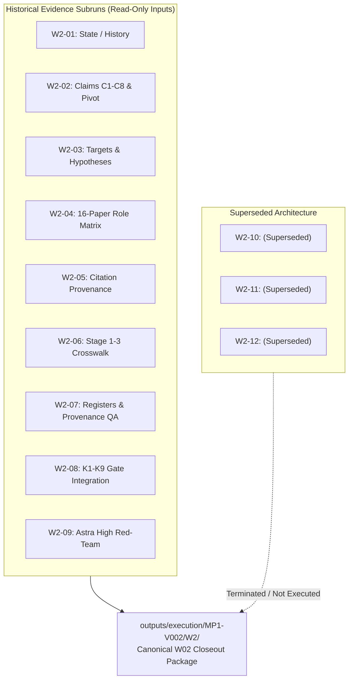

# MP1-W02 Final Macro-Stage Closeout Synthesis Report

> **Task ID:** `MP1-W02-CLOSEOUT`  
> **Role:** MP1 W02 Closeout Coordinator  
> **Model Target:** Gemini 3.8 Flash (High Reasoning Effort)  
> **Canonical Macro-Stage:** `W02`  
> **Execution Root:** `outputs/execution/MP1-V002/`  
> **Canonical Package Path:** `outputs/execution/MP1-V002/W2/`  
> **Status:** `COMPLETE` (Analytical/Evidence Work: `COMPLETE`; Scientific Candidate Status: `CONDITIONAL / BLOCKED BY UNRESOLVED TESTS`)  
> **Date:** 2026-09-26  

---

## 1. Scope of W02

Macro-stage **W02** constitutes the definitive analytical consolidation and evidence verification stage for the mentor-proposed research direction **MP1** (*Pressure-Controlled Superelastic NiTi Wire Bundle Jamming for Variable-Stiffness Mechanics*) within the verification round `MP1-V002`.

The core mission of W02 is governed strictly by the foundational repository principle:
> **DO NOT DEFEND THE CURRENT IDEA. TRY TO FALSIFY IT USING THE CLOSEST PRIOR WORK.**

W02 was chartered to evaluate whether the mentor-proposed mechanism—actively pressurized superelastic NiTi wire bundles undergoing bending—survives rigorous falsification against primary literature, or whether it collapses to established prior art, trivial parameter substitution, or observational non-identifiability.

### Operational Guardrails Enforced:
1. **Zero New Literature Search (`NEW_LITERATURE_SEARCH = false`):** No new literature search was opened, and no new papers were ingested into the corpus.
2. **Zero Ingestion (`NEW_PAPERS_ADDED = false`):** The canonical evidence matrix remains locked at the 16 full-text papers of `outputs/verification/MP1-V002/verification_matrix.json`.
3. **No New Sol / Astra Runs:** Consolidates existing runs; no new external multi-model reasoning or critique calls were launched.
4. **No Final Novelty Adjudication (`FINAL_NOVELTY_ADJUDICATION = NOT PERFORMED`):** W02 is an evidence closeout and reconciliation package; it does not claim global novelty, nor does it override master project governance.
5. **No Cross-Direction Adjudication (`D1_ANALYSIS = NOT PERFORMED`, `D1-vs-MP1_COMPARISON = NOT PERFORMED`):** Master project governance already selected `D1_M1` under `LOCK_WITH_FEASIBILITY_GATE`; MP1 is evaluated strictly as an archived viable candidate.
6. **Preservation of Historical Subruns:** Subruns `W2-01` through `W2-09` are treated as read-only historical evidence artifacts. None were modified, moved, renamed, or deleted.

---

## 2. Architecture Correction

The original execution architecture erroneously decomposed macro-stage W02 into a long sequential chain of 12 distinct stages (`W2-01` through `W2-12`):

```
[OLD ERRONEOUS SEQUENTIAL ARCHITECTURE]
W2-01 -> W2-02 -> W2-03 -> W2-04 -> W2-05 -> W2-06 -> W2-07 -> W2-08 -> W2-09 -> W2-10 -> W2-11 -> W2-12
```

This linear chaining introduced artificial workflow latency, redundant dependency gates, and conflicting intermediate state assertions. 

### Architectural Action Taken:
- The subruns `W2-01` through `W2-09` were formally re-classified as **historical evidence-generation subruns** of a single macro-stage `W02`.
- The proposed trailing sequence (`W2-10`, `W2-11`, `W2-12`) is formally marked **`SUPERSEDED_BY_W02_CLOSEOUT`**.
- None of `W2-10`, `W2-11`, or `W2-12` were executed.
- Macro-stage W02 is closed canonically within the unified closeout directory `outputs/execution/MP1-V002/W2/`.



---

## 3. Historical Subrun Map (W2-01 → W2-09)

The 9 historical subruns produced 68 top-level machine and human-readable artifacts. Their respective roles and deliverables are cataloged below:

| Subrun | Title / Core Role | Key Deliverables Produced | Main Scientific Contribution |
|:---:|---|---|---|
| **W2-01** | State & Scientific Lineage Reconstruction | `MP1_HISTORICAL_STATE_REGISTER.json/.md`<br>`MP1_HISTORICAL_TRANSITIONS.json`<br>`W2_01_STATE_HISTORY_REPORT.md` | Mapped 16 chronological states (S01–S16) and 15 transitions (T01–T15) with exact Git commit hashes; anchored State-at-Time baseline. |
| **W2-02** | C1–C8 Claim Reconstruction & Pivot | `MP1_C1_C8_CLAIM_MATRIX.json/.md`<br>`MP1_MECHANICS_PIVOT_MAP.json`<br>`W2_02_C1_C8_CLAIM_REPORT.md` | Traced demolition of device-level claims C1–C4, C8; narrowed C6 to boundary condition; reformulated C7 to model discrimination. |
| **W2-03** | Targets T1–T3 & Hypotheses H0a/H0b/H1 | `MP1_T1_T2_T3_TARGET_MATRIX.json/.md`<br>`MP1_H0a_H0b_H1_HYPOTHESIS_MATRIX.json/.md`<br>`MP1_PARAMETER_SUBSTITUTION_RECONSTRUCTION.json`<br>`MP1_COEXISTENCE_IDENTIFIABILITY_MAP.json` | Refuted naive elastic substitution $H_{0a}$; established $H_{0b}$ as live competitor null model; demonstrated $H_1$ lacks empirical evidence. |
| **W2-04** | 16-Paper Role Matrix & Full-Text Evidence | `MP1_16_PAPER_ROLE_MATRIX.json/.md`<br>`MP1_16_PAPER_CLAIM_CROSSWALK.json`<br>`W2_04_16_PAPER_ROLE_REPORT.md` | Extracted explicit equation, table, and figure citations across 16 canonical papers grouped into 5 mechanics clusters. |
| **W2-05** | Citation Provenance & Branch Reconciliation | `MP1_CITATION_BRANCH_TABLE.json/.md`<br>`MP1_CITATION_PROVENANCE_MAP.json`<br>`W2_05_RAW_UNIQUE_RECONCILIATION.json`<br>`W2_05_CITATION_PROVENANCE_REPORT.md` | Reconciled 312 raw to 258 unique records across 15/15 branches (9 backward, 6 forward); confirmed B11+B12 resolution (68 raw/67 unique). |
| **W2-06** | Stage 1–3 Accountability Crosswalk | `MP1_STAGE1_PACKET_MATRIX.json/.md`<br>`MP1_G01_G12_CRITIQUE_MATRIX.json/.md`<br>`MP1_W01_W11_REMEDIATION_MATRIX.json/.md`<br>`MP1_STAGE_G_W_CROSSWALK.json` | Crosswalked initial packets (W01–W11), Astra critiques (G01–G12), and Stage 3 remediations across 12 unbroken chains (CW-01 to CW-12). |
| **W2-07** | Registers & Provenance QA | `MP1_NON_NOVELTY_REGISTER.json/.md`<br>`MP1_NOVELTY_CANDIDATE_REGISTER.json/.md`<br>`MP1_UNRESOLVED_THREAT_REGISTER.json/.md`<br>`MP1_CONTRADICTION_REGISTER.json/.md`<br>`MP1_PROVENANCE_QA.json/.md` | Formatted formal registers; verified 100% provenance coverage (`PASS_WITH_WARNINGS`); cataloged 6 major unresolved threats. |
| **W2-08** | K1–K9 Kill-Gate Integration | `MP1_KILL_TEST_MATRIX.json/.md`<br>`MP1_KILL_GATE_DECISION.json/.md`<br>`W2_08_BLOCKING_THREATS.json`<br>`W2_08_KILL_GATE_REPORT.md` | Audited candidate through 9 kill-tests; issued verdict `OVERALL_GATE_STATUS = BLOCKED` due to 5 unresolved tests (K2, K3, K6, K7, K9). |
| **W2-09** | Astra High Adversarial Red-Team | `MP1_RED_TEAM_CHALLENGE_REGISTER.json`<br>`W2_09_ASTRA_RED_TEAM_REPORT.md` | Independent red-team critique by GPT-6 Astra High; confirmed 8 critical and high blocking issues; reinforced BLOCKED status. |

---

## 4. Evidence Base

The definitive evidence base for MP1-V002 comprises **16 primary full-text peer-reviewed papers** on disk, verified against repository copies:

| Index | Paper ID | Citation | Core Role in Mechanics Audit | Primary Data / Evidence Pointer |
|:---:|:---:|---|---|---|
| **01** | `00414aac4b` | Reedlunn et al. (2013, Part I) | Multi-wire NiTi cable isothermal tension mechanics | Fig. 4 (cable tension response), Fig. 8 (wire pull-out) |
| **02** | `fac21c950e` | Reedlunn et al. (2013, Part II) | Subcomponent kinematics & Costello model limits | Section 4.2, Table 2; Costello kinematic divergence at steep helix |
| **03** | `40760daa02` | Carboni & Lacarbonara (2016) | Pinched hysteresis in NiTi multi-wire absorbers | Fig. 6, Eq. (12)–(18); combined phase transformation + contact damping |
| **04** | `2f7fcf2f8f` | Fang et al. (2019) | NiTi cable hysteretic modeling & bridge application | Section 3.2, Fig. 7; macromodel parsimony under tension |
| **05** | `7f3f45407f` | Salvatore et al. (2021) | Wire rope isolator nonlinear dynamics & contact | Section 2.1, Fig. 4; Bouc-Wen identification of friction loops |
| **06** | `1c81b2d35c` | Narjabadifam et al. (2024) | Steel vs NiTi wire rope experimental assessment | Section 3, Table 3; fabrication and mechanical hysteresis contrast |
| **07** | `9f4295be23` | Barsi, Carboni & Lacarbonara (2025) | Short wire rope mechanics under flexure & tension | Eq. (14)–(22); stick-slip transition boundaries under transverse load |
| **08** | `56793dea9b` | Kang et al. (2020) | FEM for superelastic SMA cables with beam contact | Section 2, Fig. 3; Abaqus beam contact formulation for NiTi |
| **09** | `d9966f2f5e` | Carboni, Lacarbonara & Auricchio (2015) | Multi-configuration Nitinol vs steel strand hysteresis | Table 4 (S1a NiTi tension-bending vs S2a steel pure friction) |
| **10** | `9e15094d68` | Liu et al. (2023) | Simplified FE model for superelastic SMA cables | Section 2.2; phenomenological wire contact discretization |
| **11** | `53200aa0c6` | Vahidi et al. (2022) | Single- and double-helix SMA wire rope 3D FEA | Section 3.1, Fig. 5; Auricchio UMAT + Coulomb penalty contact |
| **12** | `98fee47c04` | Niu & Chen (2021) | Nonlinear vibration isolation via NiTi wire rope | Section 2, Fig. 2; cyclic energy dissipation under transverse load |
| **13** | `aaad9c248c` | Xin Liu (2004) | Cable vibration considering internal friction | Section 3.1, Eq. (3.15); classical inter-wire stick-slip mechanics |
| **14** | `ccdc1bb980` | Tjahjanto, Tyrberg & Mullins (2017) | Submarine cable cores under radial confinement | Eq. (8)–(14); slip mechanics under 0.2 MPa external contact pressure |
| **15** | `e8462758c3` | Liu et al. (2026) | Braided NiTi microfilaments high damping capacity | Section 3, Fig. 2; microfilament frictional and phase dissipation |
| **16** | `6dd1ca94d1` | Silva et al. (2022) | NiTi superelastic micro-cables dynamic fatigue | Section 3.2, Fig. 4; self-heating and cyclic thermomechanical life |

---

## 5. Claims C1–C8 Final Reconciled State

The initial 8 claims formulated during MP1-V001 have been completely reconciled:

```
[CLAIM RECONCILIATION SUMMARY]
CLOSED:                 5  (C1, C2, C3, C4, C5)
PREEMPTED:              1  (C8)
NARROWED (BOUNDED):     1  (C6 -> Experimental Boundary Condition)
SURVIVES AS CANDIDATE:  1  (C7 -> Model Discrimination Question)
```

| ID | Claim Formulation | Status | Decision | Primary Counter-Evidence / Basis |
|:---:|---|:---:|:---:|---|
| **C1** | Metallic wire/fiber jamming for tunable stiffness is novel | `CLOSED` | `REJECT` | Bai et al. (2022) [detachable soft wire jamming actuators]; Zhang & Yao (2026) [positive-pressure fiber jamming]. |
| **C2** | Positive-pressure jamming for tunable stiffness is novel | `CLOSED` | `REJECT` | Liu et al. (2021) [positive-pressure jamming up to 200 kPa]; Zhang & Yao (2026) [positive pressure up to 300 kPa]. |
| **C3** | Co-existence of SMA and jamming in variable-stiffness device | `CLOSED` | `REJECT` | Takashima et al. (2022, 2026) [SMA link + jamming]; Matsumoto et al. (2024) [R-phase NiTi wire jamming]. |
| **C4** | Onboard/compact pressure source powering jamming | `CLOSED` | `REJECT` | Huynh et al. (2022) [untethered soft robot micropumps]; Wang et al. (2024) [piston-like particle jamming]. |
| **C5** | Superelastic NiTi wires themselves acting as jamming medium | `CLOSED` | `REJECT` | Carboni et al. (2015) [inter-wire friction in Nitinol strands]; Vahidi et al. (2022) [multi-wire NiTi cable contact]. |
| **C6** | Positive-pressure confinement of NiTi bundle creates new mechanics | `NARROWED` | `REFORMULATE` | Demoted to experimental boundary condition ($\boldsymbol{\sigma}\cdot\mathbf{n} = -p(t)\mathbf{n}$). Standard continuum contact equations naturally accept $p(t)$ (Tjahjanto 2017). |
| **C7** | Coupled superelasticity, inter-wire friction, pressure & stiffness | `SURVIVES_AS_CANDIDATE` | `REFORMULATE` | Narrowed strictly to a model-discrimination question: Does locked $H_{0b}$ fail to predict pressure-controlled bending response, requiring $H_1$? |
| **C8** | SMA syringe/piston mechanism powering jamming pressure | `PREEMPTED` | `REJECT` | Pierce & Mascaro (2013) [SMA wire pumps]; Wang et al. (2024) [miniature piston jamming]. Hardware substitution only. |

---

## 6. Targets T1–T3 Final Reconciled State

| Target ID | Core Definition | Initial Status | Final Reconciled Status | Remaining Value / Risk |
|:---:|---|:---:|:---:|---|
| **T1** | NiTi inter-wire contact, friction, and slip | Open in V001 | `CLOSED` | **Scientific Value:** Zero as an independent novelty claim; essential physical baseline in $H_{0b}$.<br>**Execution Risk:** Low (well-established). |
| **T2** | Positive radial/transverse confinement pressure | Open in V001 | `NARROWED_TO_EXPERIMENTAL_BC` | **Scientific Value:** Experimental control protocol to modulate normal tractions; zero constitutive novelty.<br>**Execution Risk:** High ($p \to f_n$ transmission loss, void arching). |
| **T3** | Coupled NiTi superelasticity + inter-wire friction | Open in V001 | `REFORMULATED_TO_MODEL_DISCRIMINATION` | **Scientific Value:** High conditional value if $H_{0b}$ demonstrably breaks down; zero if $H_{0b}$ suffices.<br>**Execution Risk:** Critical (identifiability, sensor integration). |

---

## 7. Hypotheses H0a / H0b / H1 Final Reconciled State

The tripartite hypothesis architecture resolves the foundational logical fallacy identified by Astra:

$$\text{Rejection of } H_{0a} \centernot\implies H_1 \text{ is true}$$

```
                [HYPOTHESIS STATE RECONCILIATION]

   H0a: Naive Elastic Substitution (E = const)
   └── Status: REFUTED_IN_TRANSFORMATION_REGIME
       (Rejection is trivial strawman; does not prove H1)

   H0b: Established NiTi Constitutive Model + Coulomb Contact
   └── Status: NOT_FALSIFIED / LIVE COMPETITOR
       (Strongest scientific adversary; commercial UMATs unrefuted)

   H1: Novel Distinct Constitutive-Contact Coupling Law
   └── Status: INSUFFICIENT_EVIDENCE
       (Candidate hypothesis only; unproven empirically)
```

1. **$H_{0a}$ (Naive Constant-Modulus Substitution):** Predicts bundle bending by substituting an effective linear elastic modulus $E = \text{const}$ into classical wire rope equations.
   - **Verdict:** `REFUTED_IN_TRANSFORMATION_REGIME`.
   - **Grounded Basis:** Once outer fiber strain exceeds transformation threshold ($\varepsilon > \varepsilon_{\text{tr}} \approx 0.75\%$), $E$ varies strongly with stress and history. However, refuting a constant-modulus strawman does not license a claim of a new physical law.
2. **$H_{0b}$ (Established Transformation-Aware NiTi Model + Coulomb Contact):** Couples standard phenomenological superelastic constitutive models (Auricchio, Graesser-Cozzarelli) with standard Coulomb friction and beam contact kinematics under boundary traction $p(t)$.
   - **Verdict:** `NOT_FALSIFIED / LIVE COMPETITOR`.
   - **Grounded Basis:** Vahidi et al. (2022) and Kang et al. (2020) show standard finite-element contact models reproduce multi-wire NiTi cable hysteresis without adding new micro-coupling laws. $H_{0b}$ is the primary scientific competitor.
3. **$H_1$ (Novel Constitutive-Contact Coupling Law):** Posits that the physical interaction between Martensitic phase transformation and inter-wire frictional stick-slip creates a distinct coupled constitutive state that $H_{0b}$ cannot predict.
   - **Verdict:** `INSUFFICIENT_EVIDENCE`.
   - **Grounded Basis:** No experimental or simulation data exists in the repository demonstrating a breakdown of $H_{0b}$ under locked calibration. $H_1$ survives only as an unverified hypothesis.

---

## 8. K1–K9 Reconciled State

The 9 kill-tests from W2-08 have been reconciled with W2-09 Astra High findings:

```
[K1–K9 RECONCILED GATE AUDIT]
Total Tests:        9
Kill (Fatal):       0
Partial Overlap:    3  (K1, K4, K8)
No Kill Found:      1  (K5 - protocol closed)
Unresolved:         5  (K2, K3, K6, K7, K9)
Overall Status:     BLOCKED
Blocking Tests:     8  (K1, K2, K3, K4, K6, K7, K8, K9)
Non-blocking Tests: 1  (K5 - citation protocol satisfied)
```

| Test ID | Core Mechanics Question | W2-08 Verdict | W2-09 Astra Challenge | Final Reconciled Status | Blocking? |
|:---:|---|:---:|---|:---:|:---:|
| **K1** | Accessible coexistence of slip and NiTi transformation | `PARTIAL_OVERLAP` | Analytical bound (~0.75%) established; accessible physical domain unproven; small-strain collapse. | `PARTIALLY_RESOLVED_BLOCKING` | **YES** |
| **K2** | Sufficiency of established $H_{0b}$ model | `UNRESOLVED` | Critical confirmed gap; $H_{0b}$ forward simulation with locked calibration absent; $H_{0a}$ rejection irrelevant. | `UNRESOLVED_BLOCKING` | **YES** |
| **K3** | Mechanism identifiability from macroscopic $M-\kappa$ | `UNRESOLVED` | Critical confirmed gap; global softening observationally degenerate; local sensors proposed but unexecuted. | `UNRESOLVED_BLOCKING` | **YES** |
| **K4** | Architectural contribution collapse | `PARTIAL_OVERLAP` | Device/jamming novelty eliminated; contribution conditional solely on measurable $H_{0b}$ failure. | `PARTIALLY_RESOLVED_BLOCKING` | **YES** |
| **K5** | Closer prior art & citation closure | `NO_KILL_FOUND` | 15/15 stop condition satisfied under protocol; citation closure is protocol closure, not universal novelty. | `RECONCILED_PROTOCOL_CLOSED` | **NO** |
| **K6** | Pressure-to-normal-force mapping ($p \to f_n$) | `UNRESOLVED` | High confirmed gap; membrane hoop stress and void arching make $p \to f_n$ underdetermined without calibration. | `UNRESOLVED_BLOCKING` | **YES** |
| **K7** | Incremental beam/cable formulation sufficiency | `UNRESOLVED` | Existing incremental formulations accept nonlinear tangent modulus; missing coupling term unproven. | `UNRESOLVED_BLOCKING` | **YES** |
| **K8** | Parameter leakage and compensation | `PARTIAL_OVERLAP` | High confirmed gap; Locked Calibration Rule is a protocol rule, not demonstrated data; risk of parameter leakage. | `PARTIALLY_RESOLVED_BLOCKING` | **YES** |
| **K9** | Hysteresis observability & thermal confounding | `UNRESOLVED` | Latent heat ($10\text{–}25\text{ J/g}$) and self-heating shift transformation stress ($\sim 6\text{–}8\text{ MPa/}^\circ\text{C}$); isothermal rate control required. | `UNRESOLVED_BLOCKING` | **YES** |

---

## 9. Astra W2-09 Challenge Integration

The adversarial red-team conducted by GPT-6 Astra High (`W2-09_ASTRA_RED_TEAM_REPORT.md`) confirmed 8 structural blocking issues that govern this closeout:

1. **$H_{0a}$ Refutation Does Not Advance $H_1$:** Disproving an uncalibrated constant-modulus elastic model merely indicates material nonlinearity; it provides zero evidence for a new micro-coupling law.
2. **$H_{0b}$ Remains Unchallenged:** Neither the 16-paper corpus nor existing repository code contains a withheld-data benchmark demonstrating $H_{0b}$ failure.
3. **Chamber Pressure is Not Contact Force:** A pressure transducer on the pneumatic sleeve measures boundary traction, not the inter-wire normal force $f_n$. Frictional shear capacity is governed by $f_n$, which is attenuated by membrane hoop stress and internal geometric arching.
4. **Degeneracy of Global $M-\kappa$ Curves:** Macroscopic softening during bending can be produced by: (a) NiTi Martensitic transformation, (b) inter-wire frictional slip, (c) cross-sectional ovalization, (d) clamp compliance, or (e) membrane stretching. Global moment-curvature data cannot distinguish these mechanisms.
5. **Locked Calibration is a Mandated Rule, Not an Accomplished Fact:** Declaring that parameters will be locked does not guarantee they can be identified without cross-talk or compensation.
6. **Coexistence is Strictly a Feasibility Hypothesis:** At small bending curvatures ($\kappa < \kappa_{\text{tr}}$), outer fibers do not reach transformation stress; the bundle acts as an ordinary elastic wire jamming beam ($H_{0a}$ domain). At large curvatures, membrane puncture and low-cycle wire fatigue threaten specimen survival.
7. **Citation Protocol Closure vs Universal Absence:** Achieving 15/15 direction screening means the documented search stopped legitimately according to protocol; it does not prove universal non-existence of prior art in the wider mechanical literature.
8. **Thermal and History Confounding:** Latent heat of transformation causes dynamic self-heating, shifting the transformation plateau and altering tangent stiffness independently of friction.

---

## 10. Citation Closure Clarification

The citation stopping state underwent a critical historical evolution between subrun W2-08 and final canonical adjudication:

- **Historical State at W2-08:** Subrun W2-08 reported `stop_condition_satisfied = false`, flagging open branches B11 (Kang et al. 2020) and B12 (Barsi et al. 2025) as a blocking threat (`THREAT-05` / `BLOCK-07`).
- **Current Canonical State:** Canonical `outputs/verification/MP1-V002/citation_coverage.json` and `FINAL_ADJUDICATION.json` confirm that branches B11 (22 records screened) and B12 (46 records screened) were fully completed, resolving 68 raw records into 67 unique candidates. All 15 required directions (9 backward, 6 forward) are 100% screened.
- **Protocol Stopping Outcome:** `stop_condition.satisfied = true`, `search_cutoff_date = 2026-09-25`.
- **Mandatory Caveat:** Citation protocol closure satisfies the defined repository protocol stopping rules. It **does NOT constitute mathematical proof of universal prior-art absence** across global engineering literature.

---

## 11. Provenance QA

Provenance verification achieved **`PASS_WITH_WARNINGS`** across the entire W02 corpus:

- **Claim Coverage:** 8 / 8 claims (100%) trace to primary PDF literature and historical commits.
- **Target Coverage:** 3 / 3 targets (100%) trace to explicit protocol definitions and physical papers.
- **Hypothesis Coverage:** 3 / 3 hypothesis tiers (100%) trace to formal mechanics definitions.
- **Paper Full-Text Verification:** 16 / 16 papers exist as verified physical PDF files in `data/papers/verification/MP1-V002/` and match extracted JSON records.
- **Unsupported Claims:** 0.
- **Invalid Pointers:** 0.
- **Metadata Conflicts:** 0.
- **Warnings Recorded:** Residual blocking threats K1, K2, K3, K6, K7, K8, K9 remain live and block novelty survival.

---

## 12. Contradiction Reconciliation

W02 cataloged and reconciled 9 contradiction candidates across workflow and evidence categories:

| ID | Title / Issue | Classification | Resolution Summary |
|:---:|---|:---:|---|
| **CONTRA-WF-01** | Evidence matrix paper count (10 vs 13 vs 16) | `RESOLVED_BY_LATER_CANONICAL_STATE` | Stage 1 had 10 papers; interim disk snapshot had 13; canonical matrix locked at 16 full-text papers at HEAD (`8ccfa3c`). |
| **CONTRA-WF-02** | Semantic conflict: 'established' vs 'insufficient' | `RESOLVED_BY_SOURCE_PRECEDENCE` | Tripartite hypothesis decoupling: 'established' refers to $H_{0a}$ refutation; evidence for $H_1$ is 'insufficient'; $H_{0b}$ is not falsified. |
| **CONTRA-WF-03** | Gap narrative vs open citation branches | `RESOLVED_BY_LATER_CANONICAL_STATE` | Overclaims demoted to provisional hypothesis; B11/B12 subsequently screened, achieving protocol closure (15/15). |
| **CONTRA-WF-04** | Thesis status: viable candidate vs approved topic | `RESOLVED_BY_LATER_CANONICAL_STATE` | Master cross-direction adjudication locked D1/M1 (`LOCK_WITH_FEASIBILITY_GATE`); MP1 archived as viable alternative. |
| **CONTRA-EV-01** | Carboni (2015) S2a vs S1a attribution error | `RESOLVED_BY_SOURCE_PRECEDENCE` | Primary PDF Table 4 proves S2a is ST49 steel strand (pure friction); S1a is NiTi7 under tension-bending. Pure bending claims expunged. |
| **CONTRA-EV-02** | Active pressure $P_3$: mechanics novelty vs BC | `RESOLVED_BY_SOURCE_PRECEDENCE` | Pressure enters differential equations strictly as surface traction boundary condition ($\boldsymbol{\sigma}\cdot\mathbf{n} = -p(t)\mathbf{n}$). |
| **CONTRA-EV-03** | Reedlunn (2013) Costello error attribution | `RESOLVED_BY_SOURCE_PRECEDENCE` | Costello error is due to neglecting local bending/twisting moments in steep outer strands, not missing straight bundle contact theory. |
| **CONTRA-EV-04** | Parameter compensation vs locked calibration | `STILL_OPEN_NONBLOCKING` | Locked Calibration Rule adopted methodologically; physical execution on test bench remains open for future research. |
| **CONTRA-STALE-K5** | Stale W2-08 K5 citation stopping status | `RESOLVED_BY_LATER_CANONICAL_STATE` | Preserved W2-08 as State-at-Time; current canonical state confirmed as protocol closure satisfied with universal prior art caveat. |

---

## 13. Current MP1 Candidate

The narrowest defensible scientific formulation of MP1 is designated:

### `CURRENT_MP1_CANDIDATE`
*(Not a Final Thesis Topic; An Archived Conditional Candidate)*

> **"Across a declared, experimentally accessible range of positive confinement pressure, curvature, and temperature where both inter-wire slip and stress-induced Martensitic transformation coexist, does an established transformation-aware NiTi constitutive and Coulomb-contact model ($H_{0b}$) under locked parameter calibration adequately predict the pressure-dependent moment-curvature response, tangent bending stiffness, hysteresis loops, and local slip/transformation observables of a superelastic NiTi wire bundle, or does model failure under held-out conditions demonstrate the necessity of a novel constitutive-contact coupling law ($H_1$)?"**

### Absolute Exclusions (What MP1 Does NOT Claim):
- **NO Device-Level Novelty:** Combining wires, positive pressure, and jamming in soft actuators is established prior art (Bai 2022, Liu 2021, Takashima 2022–2026, Wang 2024).
- **NO Generic Pressure-Controlled Stiffness Novelty:** Applying active pressure is an experimental boundary condition, not a new mechanics law.
- **NO Claim of $H_1$ as Established:** $H_1$ is an unverified hypothesis; $H_{0a}$ refutation does not support $H_1$.
- **NO Universal Prior-Art Absence:** Absence of closer prior art is verified only within the protocol boundary.

---

## 14. Blocking Scientific Gaps

Eight scientific gaps currently block MP1 from claiming novelty survival:

1. **`GAP-01` (H0b Locked Forward Prediction Absent):** No simulation benchmark exists showing that an independently calibrated Auricchio-Coulomb contact model fails to predict bundle bending.
2. **`GAP-02` (Mechanism Non-Identifiability from Macroscopic $M-\kappa$):** Softening from phase transformation, friction, ovalization, and membrane compliance are observationally degenerate in global measurements.
3. **`GAP-03` (Pressure Transmission Mapping $p \to f_n$ Uncertainty):** Membrane hoop stress and geometric void arching attenuate internal contact forces by unknown, curvature-dependent factors.
4. **`GAP-04` (Parameter Leakage & Compensation under Free Fitting):** Simultaneous parameter fitting allows a deficient model to match experimental data through unphysical trade-offs.
5. **`GAP-05` (Slip-Transformation Coexistence Feasibility Domain):** It is unproven that physical wire bundles can reach the transformation strain threshold ($\sim 0.75\%$) without membrane rupture or fatigue failure.
6. **`GAP-06` (Thermal & Rate Confounding of Hysteresis):** Transformation latent heat ($10\text{–}25\text{ J/g}$) alters wire temperature dynamically ($d\sigma/dT \approx 6\text{–}8\text{ MPa/}^\circ\text{C}$), confounding friction hysteresis.
7. **`GAP-07` (Existing Incremental Cable/Contact Formulation Sufficiency):** Classical stick-slip beam mechanics may already capture the response once supplied with nonlinear tangent modulus.
8. **`GAP-08` (Local Observable Measurement Feasibility):** Embedding optical FBG sensors or slip probes inside a sealed positive-pressure sleeve without altering packing mechanics remains unverified.

---

## 15. What W02 Proves

1. **Demolition of Architectural Novelty:** Proves conclusively that combining metallic wires, positive fluid pressure, jamming, and SMA actuators does not constitute scientific novelty.
2. **Refutation of Naive Elastic Substitution ($H_{0a}$):** Proves that treating superelastic NiTi wires as constant-modulus elastic beams fails when strain exceeds transformation thresholds.
3. **Demotion of Active Pressure ($P_3$):** Proves mathematically that positive chamber pressure operates strictly as an external traction boundary condition.
4. **Establishment of $H_{0b}$ as Primary Competitor:** Proves that existing commercial FEM formulations and transformation models represent the legitimate null hypothesis.
5. **Correction of Evidence Attribution:** Corrects the Carboni 2015 extraction error (S2a is steel pure-friction, S1a is NiTi tension-bending) and Costello model interpretation.
6. **Citation Protocol Closure:** Proves that all 15 targeted citation branches reached protocol stopping conditions on 2026-09-25 with zero unresolved direct kills inside the protocol.

---

## 16. What W02 Does NOT Prove

1. **Does NOT Prove Global Novelty:** W02 does not prove that MP1 is novel, nor does it guarantee the absence of prior art outside the protocol.
2. **Does NOT Prove $H_1$:** W02 provides zero evidence that a new constitutive-contact coupling law exists or is needed.
3. **Does NOT Prove Coexistence Feasibility:** W02 does not prove that simultaneous slip and transformation can be achieved durably on a physical test bench.
4. **Does NOT Prove $H_{0b}$ Breakdown:** W02 contains no forward simulation showing $H_{0b}$ error exceeding experimental tolerance.
5. **Does NOT Prove That MP1 Should Be the Thesis Topic:** W02 does not override master project governance selecting D1/M1.

---

## 17. Current Readiness

```
[W02 READINESS DASHBOARD]
Analytical / Evidence Closeout:   COMPLETE (100%)
Repository Architecture State:    CLEAN / CONSOLIDATED
Scientific Gate Status:           BLOCKED (by 5 unresolved K-tests & 8 gaps)
Candidate Status:                 CONDITIONAL (Archived Viable Alternative)
Active Thesis Direction:          D1_M1 (Preserved and Locked with Feasibility Gate)
```

W02 achieves full procedural and analytical completion as an evidence consolidation stage. Scientifically, MP1 remains conditional and blocked from asserting novelty.

---

## 18. Handoff to Next Top-Level Workflow Stage

In strict compliance with Section 27 (Handoff Rule):
- The erroneous sequential chain `W2-10`, `W2-11`, `W2-12` is terminated and superseded.
- No new top-level MP1 stages (e.g. W03) are invented or assumed.
- Within the MP1 workflow context, execution transitions to:

```text
NEXT_TOP_LEVEL_DEPENDENCY = AWAITING_WORKFLOW_RECONCILIATION
```

At the master project level, direction `D1_M1` is currently active under `LOCK_WITH_FEASIBILITY_GATE`, advancing toward the *D1/M1 boundary-resolvability pilot* (`docs/project/PROJECT_HANDOFF_CURRENT.md`). MP1 remains safely preserved and cataloged in the repository as a closed, verified, and conditional alternative.
