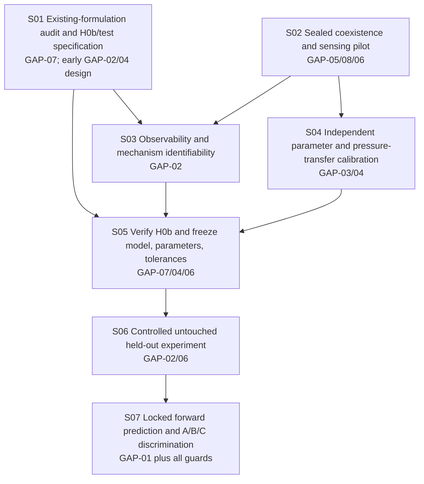

# MP1-WR1 — Workflow reconciliation and next-stage routing

**Status:** routing complete; scientific gate remains **BLOCKED**.

**Date:** 2026-09-26 (Asia/Bangkok).
**Scope:** design the minimum future test of whether the strongest existing-model competitor H0b is sufficient. No experiment, new search, model fit, H1 formulation, novelty adjudication or D1 comparison was performed here.

## 1. Objective and authority

The decision question is: across a *measured* domain in which inter-wire slip and stress-induced NiTi transformation coexist, can a transformation-aware constitutive law plus established frictional contact, cable/beam mechanics and membrane confinement predict held-out global and local response under independently locked parameters? An adequate H0b ends the proposed need for an additional constitutive-contact law. A failed H0b only motivates a later H1 formulation if the residual is systematic, exceeds predeclared experimental/model uncertainty, and tracks independent local mechanism measurements.

Execution authority is [CURRENT_EXECUTION_SNAPSHOT.md](../../../../docs/project/CURRENT_EXECUTION_SNAPSHOT.md), [research_state.json](../../../../docs/project/research_state.json), and the W02 canonical [final state](../W2/MP1_W02_FINAL_STATE.json), [synthesis](../W2/MP1_W02_FINAL_SYNTHESIS.md), [gap register](../W2/MP1_W02_BLOCKING_GAP_REGISTER.json), [K-test matrix](../W2/MP1_W02_K1_K9_RECONCILED_MATRIX.json), [claim/hypothesis matrix](../W2/MP1_W02_CLAIM_TARGET_HYPOTHESIS_MATRIX.json), [contradiction register](../W2/MP1_W02_CONTRADICTION_RECONCILIATION.json) and [source manifest](../W2/MP1_W02_SOURCE_MANIFEST.json). These relative links are document navigation; structured JSON has precedence over historical subrun narratives. The W02 manifest links the primary full-text PDFs and historical extraction lineage. This WR1 report does not independently re-extract those PDFs.

**VERIFIED REPOSITORY STATE:** H0a = `REFUTED_IN_TRANSFORMATION_REGIME`; H0b = `NOT_FALSIFIED / LIVE COMPETITOR`; H1 = `INSUFFICIENT_EVIDENCE`. Candidate = `CONDITIONAL`; scientific gate = `BLOCKED`. The citation protocol closed at 15/15 directions (9/9 backward, 6/6 forward; 2026-09-25 cutoff). This is a protocol result, not universal prior-art absence. W2-10 through W2-12 were not executed and are superseded. W02 [contradiction reconciliation](../W2/MP1_W02_CONTRADICTION_RECONCILIATION.json) corrects the Carboni specimen attribution and the stale W2-08 citation status; neither should be reintroduced.

## 2. Why the suggested linear topology changes

**INFERENCE / ROUTING DECISION:** The proposed chain “physical feasibility → observability → baseline → calibration → experiment → prediction” puts the cheap existing-formulation audit too late. A source-grounded K7 audit and baseline specification can start immediately, in parallel with a cheap sealed-prototype pilot. It may invalidate the supposed missing-law rationale before substantial apparatus work. The pilot, in turn, can kill the current coupling-core question before calibration or full validation. The graph therefore has **two entry stages**, then converges before model lock and held-out testing.

The graph also distinguishes *preparatory work* from *gap resolution*. An analytical coexistence bound can be computed before local sensors exist; proving simultaneous slip and transformation needs a working local observable. Model code can be prepared before calibration, but a locked H0b comparison cannot occur until independent parameters, pressure-transfer uncertainty and measurement identifiability are resolved. No dependency arrow licenses H1 by itself.

| W02 gap | Scientific route | Earliest decisive stage | Final resolution stage |
|---|---|---|---|
| GAP-01 / K2 | Locked H0b forward prediction | S01 baseline selection | S07 |
| GAP-02 / K3 | Local mechanism identifiability | S01 design, S02 sensing pilot | S03, then S07 check |
| GAP-03 / K6 | Pressure-to-contact transmission with uncertainty | S02 actual geometry/domain | S04 |
| GAP-04 / K8 | Independent parameter identification and lock | S01 split/protocol | S04–S05 |
| GAP-05 / K1 | Slip–transformation coexistence | S02 | S02 |
| GAP-06 / K9 | Thermal, rate and cycle-history confounds | S02 | S02–S03, S05 thermal branch |
| GAP-07 / K7 | Strongest existing cable/contact formulation | S01 | S01 selection, S05 verified implementation, S07 sufficiency |
| GAP-08 / K3 | Local measurement under sealed pressure envelope | S02 | S02–S03 |

S01 and S02 can run in parallel. If only one owner is available, start S01 and prepare S02. S04 can run alongside S03 after S02, while S05 implementation scaffolding may proceed from S01; **S05 cannot pass its lock gate** before S03 and S04. The machine-readable [execution graph](MP1_WR1_EXECUTION_GRAPH.json) and [stage register](MP1_WR1_STAGE_GATE_REGISTER.json) encode the exact stage dependencies, outputs and failure routes.

## 3. Early stop gates

1. **Existing-model audit (S01, GAP-07/K7).** Inspect the repository's full-text Barsi 2025, Tjahjanto 2017, Xin Liu 2004, Kang 2020 and Vahidi 2022 records. Determine which incremental cable/beam-contact kinematics and finite-element contact implementation can represent the actual straight/packed bundle, bending and pressure boundary. If the alleged coupling term already exists, retire that rationale. A published formulation's applicability must be checked, not assumed. Retrieve exact named equations only if the repository lacks them.
2. **Physical coexistence (S02, GAP-05/K1).** The W02 estimate of about 0.75% transformation strain is a *planning bound*, not a pass threshold for this specimen. A sealed pilot must show repeatable, temporally overlapping slip and transformation within membrane integrity, wire fatigue and temperature limits. If it cannot, stop or narrow the MP1 coupling-core formulation. A global hysteresis loop does not show coexistence.
3. **Sealed measurement (S02, GAP-08/K3).** Demonstrate a sealed feedthrough or external method with quantified leak, packing perturbation and noise. If no observable set can discriminate mechanisms, stop H1-style mechanistic claims even if global curves are reproducible.
4. **Identifiability (S03, GAP-02/K3).** Show that local/auxiliary signatures remain distinguishable after temperature, cross-section, membrane and fixture effects are included. If sensor noise or collinearity defeats this, redesign excitation/instrumentation or narrow to H0b predictive validity.
5. **Pressure mapping and parameter independence (S04, GAP-03/K6 and GAP-04/K8).** If multiple physically plausible pressure/contact and constitutive parameter sets reverse the later H0b verdict, do not proceed to validation. Improve independent tests or shrink the domain.
6. **Locked model adequacy (S07, GAP-01/K2).** Adequate H0b ends the necessity claim for H1. A residual obtained only after invalid parameter changes or outside verified operating/measurement conditions is not discrimination.

## 4. Strongest H0b and K7 before K2

**Decision:** GAP-07 must be addressed before GAP-01 can be resolved. A weak bespoke contact model would make an H0b failure uninterpretable. H0b should use a versioned, applicable established cable/beam-contact or high-fidelity wire-contact formulation, with:

- transformation-aware, history-dependent superelastic NiTi constitutive behavior, including thermal coupling when the pilot shows it matters;
- frictional wire-to-wire contact with a physically meaningful, independently constrained coefficient and contact implementation;
- actual bundle geometry, prestrain, packing, axial load and bending boundary conditions;
- membrane mechanics and chamber pressure as **external traction**, with uncertain transmission to internal contacts handled through calibration/uncertainty, not equated to contact force;
- independently calibrated parameters and numerical convergence/implementation checks before freezing;
- no tuning against the held-out pressure-curvature bending data.

The model choice is a **later deliverable**, not a claim that one named published model already transfers unchanged to MP1 geometry. S01 must examine whether cable-specific helix or prestress assumptions apply. The [W02 K7 record](../W2/MP1_W02_K1_K9_RECONCILED_MATRIX.json) supports the threat that these formulations may suffice; it does not supply a completed MP1 forward benchmark.

Let chamber pressure be \(p\), curvature \(\kappa\), local normal force per contact \(f_n\), and friction coefficient \(\mu\). The friction bound \(|f_t|\leq\mu f_n\) does **not** license \(f_n=pA\) without a validated transfer geometry and membrane/contact state. S04 must identify either a pressure-to-contact map with uncertainty or bounds on latent contact tractions that leave the H0b adequacy decision invariant. Boundary traction \(\boldsymbol\sigma\mathbf n=-p\mathbf n\) is only the applied sleeve boundary condition; internal \(f_n\) can vary with \(p,\kappa\), packing and history.

## 5. Minimum discriminating measurement set

**INFERENCE / PROPOSED MINIMUM:** The set is defined by functions rather than mandatory sensors. Specific hardware is chosen only after S02 feasibility and S03 noise/sensitivity tests.

| Mechanism or artifact | Needed observation/control | Pilot proof required |
|---|---|---|
| Inter-wire slip | Relative wire displacement or independently calibrated end-slip/marker channel | Separates inter-wire motion from clamp and whole-bundle motion; enough spatial/temporal resolution at slip onset |
| NiTi transformation | Transformation-sensitive local state proxy, calibrated on single wire against known phase/thermomechanical response, plus local strain/stress context | Proxy cannot be explained by strain/temperature alone over the tested domain; FBG strain by itself is not a phase measurement |
| Temperature and rate | Local wire/sleeve temperature, ambient temperature, rate/dwell/cycle history | Thermal drift and rate effects quantified; nominal slow loading alone is insufficient |
| Cross-section deformation | Section width/ovalization or equivalent shape measurement | Geometry effect separated from contact slip in H0b residuals |
| Membrane effects | Membrane-only/empty-sleeve response, pressure and sleeve deformation | Membrane stiffness and pressure transmission constrained independently |
| Clamp/compliance artifacts | Fixture-only compliance, clamp slip and alignment controls | Global moment/curvature corrected with uncertainty |

Global moment \(M\) versus \(\kappa\), tangent stiffness and hysteresis remain necessary response variables, but cannot alone identify slip, transformation or an interaction law. S03 must check sensitivity matrix rank/conditioning **under measured noise** and use controls/perturbations that break equivalent signatures. A mathematically full-rank matrix with indistinguishable real measurements does not pass.

## 6. Calibration, lock and held-out governance

**CALIBRATION DATA:** separate single-wire thermomechanical cycles identify transformation onset/reversal, plateau, hardening and temperature dependence; direct shear or wire pull-out tests constrain \(\mu\) and pressure-dependent contact; membrane inflation/traction tests constrain sleeve properties and pressure transfer; image/metrology and assembly records constrain wire geometry, packing, prestrain and clamp compliance. Contact penalty or regularization parameters are numerical choices subject to convergence/physical-sensitivity tests; they must not absorb real pressure-transfer or constitutive error. Record parameter value, units, confidence range/covariance, test source, specimen lot, fit method and model version. Non-identifiable parameters remain intervals and propagate to prediction.

**HELD-OUT VALIDATION DATA:** preregister pressure, curvature, temperature/rate and cycling paths, specimen split, primary global/local outputs, error metrics and justified tolerances before acquisition/unblinding. Tolerances must incorporate instrument uncertainty, specimen variation and numerical error, and be tight enough that meaningful model differences could be resolved. No numeric tolerance is invented at WR1. Pilot data and calibration bending checks must never be silently treated as untouched validation. Acquire S06 data only after S05 code, parameter files, uncertainty procedure and protocol are frozen with recorded hashes/timestamps and human sign-off.

No parameter, pressure-transfer relation, contact law or thermal term may be refitted to S06 held-out data. If revision is scientifically necessary, mark that frozen H0b version **failed**, open a new model version, redo independent calibration as needed and obtain a new untouched validation set. A free-fit result may diagnose compensation, but cannot be counted as the locked forward test.

## 7. Discrimination endpoint, with no H1 verdict at WR1

**Outcome A — H0b adequate.** Locked H0b meets predeclared uncertainty-aware tolerances on the held-out domain and the relevant local observables. The experiments do not require an extra constitutive-contact coupling law; stop the H1 necessity claim for this domain.

**Outcome B — H0b systematic failure.** Locked H0b exceeds tolerances in a reproducible pattern across independent held-out conditions; residuals correlate with independently measured slip/transformation behavior and survive pressure-map, thermal, membrane, geometry, fixture and numerical uncertainty checks. This **motivates**, but does not establish, an H1 model. A later stage must formulate H1 and test it on fresh data against the strongest updated H0b.

**Outcome C — no discrimination.** Missing local channels, confounded mechanism signatures, unstable parameter maps or uncertainty larger than model differences prevents a conclusion. Redesign or narrow. H0a's refutation remains logically irrelevant to deciding between H0b and H1.

## 8. Search, provenance and unresolved work

No literature search was reopened and no new paper was added. Targeted retrieval is allowed only for a named missing item: a governing equation or applicability condition from an already named baseline paper, a necessary apparatus material/fatigue limit absent from existing evidence/direct testing, or the feasibility specification for a specific sensor/feedthrough method. Record the exact deficit, target source, reason it blocks a gate and retrieval result. A missing search hit never proves novelty.

**Evidence status:** W02 hypothesis/gap/K-test states and citation counts above are `VERIFIED REPOSITORY STATE` (canonical structured artifacts). The stage graph, minimum observable functions, model-lock policy details and early-stop ordering are `INFERENCE / PROPOSED ROUTING`; they are not experiments, source-level verification or scientific gap closure. All eight gaps remain open. Human review is required at each gate because model applicability, specimen integrity, identifiability, tolerance adequacy and consequential stop/narrow decisions cannot be inferred from workflow completion alone.

The full per-gap inputs, artifacts, pass and failure criteria are in [MP1_WR1_GAP_ROUTING_MATRIX.json](MP1_WR1_GAP_ROUTING_MATRIX.json). The concise next-session instructions are in [MP1_WR1_HANDOFF.md](MP1_WR1_HANDOFF.md).
